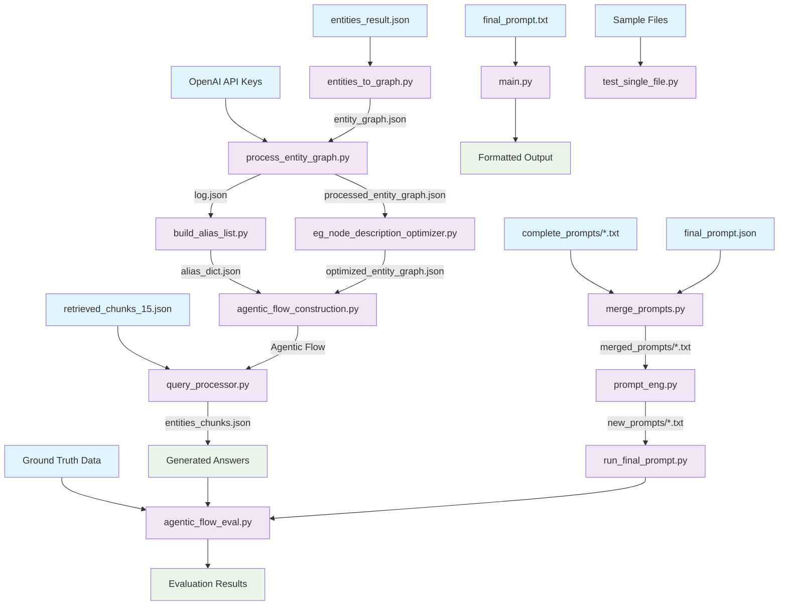

# Project Structure Overview

## 🎯 Flow Chart



## 📁 Directory Structure

```
GUIDE/
├── 📖 README.md                          # Project overview and quick start
├── 📋 PROJECT_STRUCTURE.md               # This file - structure overview
├──
├── 🗂️ src/                              # Source Code (12 main files)
│   ├── 🏗️ entities_to_graph.py           # Step 1: Raw entities → Graph
│   ├── ⚙️ process_entity_graph.py        # Step 2: Graph processing & abbreviations
│   ├── 🎯 eg_node_description_optimizer.py # Step 3: Optimize descriptions
│   ├── 🔗 build_alias_list.py           # Step 4: Build alias mappings
│   ├── 🤖 agentic_flow_construction.py  # Step 5: Multi-agent workflow
│   ├── 🎤 query_processor.py           # Step 6: Main query engine
│   ├── 📝 prompt_eng.py                # Prompt engineering & templates
│   ├── 🔄 merge_prompts.py             # Prompt merging utilities
│   ├── ▶️ main.py                      # Simple prompt runner
│   ├── 🚀 run_final_prompt.py          # Batch prompt processor
│   ├── 🧪 test_single_file.py          # Testing utilities
│   └── 📊 agentic_flow_eval.py         # Evaluation framework
├──
├── 📦 data/
│   ├── 📥 input/                        # Input data files
│   │   ├── 📄 entities_result.json           # Raw entity extraction results
│   │   ├── 📄 retrieved_chunks_15.json       # Question-chunk mappings
│   │   ├── 📄 final_prompt.json             # Final prompt templates
│   │   ├── 📁 complete_prompts/             # Source prompt files
│   │   └── 📖 README.md                     # Input data guide
│   ├── ⚡ intermediate/                 # Processing intermediate files
│   │   ├── 📄 entity_graph.json            # Initial entity graph
│   │   ├── 📄 processed_entity_graph.json  # Processed graph
│   │   ├── 📄 alias_dict.json              # Alias mappings
│   │   ├── 📄 log.json                     # Processing logs
│   │   ├── 📄 entities_chunks.json         # Entity chunks
│   │   ├── 📁 merged_prompts/              # Merged prompt files
│   │   └── 📖 README.md                     # Intermediate data guide
│   └── 📤 output/                       # Final outputs
│       ├── 📄 optimized_entity_graph.json  # Final optimized graph
│       ├── 📄 o1_answers.json              # Generated answers
│       ├── 📁 new_prompts/                 # Processed prompts
│       ├── 📁 evaluation_results/          # Evaluation outputs
│       └── 📖 README.md                     # Output data guide
├──
├── 📚 docs/                             # Documentation
│   ├── 📋 Research_CODE_Documentation.md   # Detailed file documentation
│   └── 📊 system_flowchart.md             # System flow diagrams
├──
├── 🧪 tests/                            # Test files and outputs
├──
└── ⚙️ config/                           # Configuration
    └── 📄 requirements.txt                 # Python dependencies
```

## 🚀 Execution Order

### Core Pipeline
1. **Graph Construction**: `entities_to_graph.py`
2. **Graph Processing**: `process_entity_graph.py`
3. **Description Optimization**: `eg_node_description_optimizer.py`
4. **Alias Building**: `build_alias_list.py`

### Query Processing
5. **Agentic Flow Setup**: `agentic_flow_construction.py`
6. **Query Processing**: `query_processor.py`

### Prompt Engineering (Optional)
- **Prompt Merging**: `merge_prompts.py`
- **Prompt Engineering**: `prompt_eng.py`
- **Batch Processing**: `run_final_prompt.py`

### Evaluation
- **System Evaluation**: `agentic_flow_eval.py`

## 📊 Data Flow Summary

```
Raw Data → Graph Building → Processing → Optimization → Query Engine
    ↓           ↓              ↓            ↓           ↓
Input/      Intermediate/  Intermediate/ Intermediate/ Output/
```

## 🎯 Key Features

- ✅ **Modular Design**: Each component has a specific purpose
- ✅ **Clear Data Flow**: Inputs → Intermediate → Outputs
- ✅ **Comprehensive Documentation**: Every component documented
- ✅ **Software Engineering Best Practices**: Proper directory structure
- ✅ **Evaluation Framework**: Built-in performance measurement
- ✅ **Async Processing**: Efficient LLM API usage

## 🔧 Quick Setup

1. Install dependencies: `pip install -r config/requirements.txt`
2. Set API key: `export OPENAI_API_KEY="your_key"`
3. Place input files in `data/input/`
4. Run pipeline scripts in order
5. Check results in `data/output/`