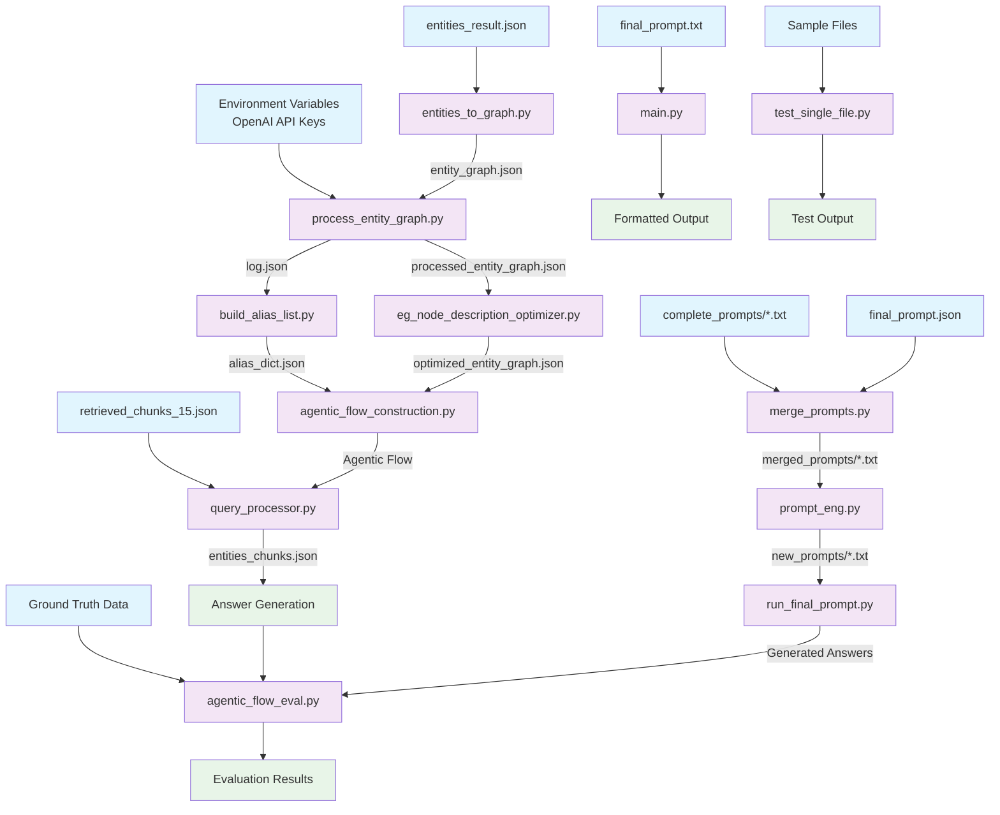

# Research_CODE System Flow Chart



## Data Flow Description

### 1. Entity Graph Construction & Processing
```
entities_result.json → entities_to_graph.py → entity_graph.json
                                           ↓
                    process_entity_graph.py → processed_entity_graph.json
                                           ↓
                    eg_node_description_optimizer.py → optimized_entity_graph.json
```

### 2. Alias & Mapping
```
log.json → build_alias_list.py → alias_dict.json
```

### 3. Prompt Engineering
```
complete_prompts/*.txt + final_prompt.json → merge_prompts.py → merged_prompts/*.txt
                                                              ↓
                                           prompt_eng.py → new_prompts/*.txt
```

### 4. Query Processing
```
retrieved_chunks_15.json + optimized_entity_graph.json + alias_dict.json
                                           ↓
                    query_processor.py + agentic_flow_construction.py
                                           ↓
                                   entities_chunks.json
```

### 5. Answer Generation & Evaluation
```
new_prompts/*.txt → run_final_prompt.py → o1_answers.json
                                       ↓
Ground Truth + Generated Answers → agentic_flow_eval.py → Evaluation Results
```